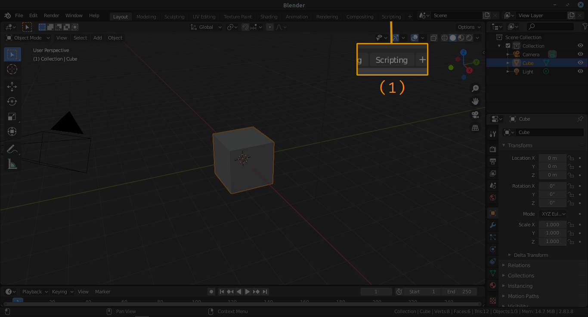
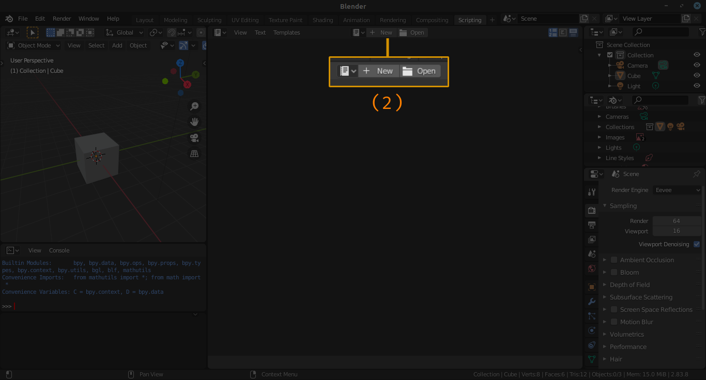
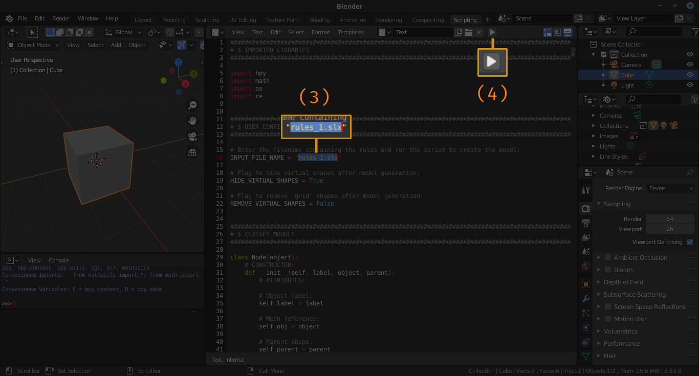

# 🧑‍💻 Código-fonte

Para gerar os modelos por meio do [Blender](https://www.blender.org/download/lts/) (versão 2.83.8) basta executar os seguintes passos:

- **(1) Acessar o workspace de programação:**

- **(2) Criar ou importar o código-fonte (main.py):**

- **(3) Alterar nome do arquivo com as regras e (4) rodar o script:**

