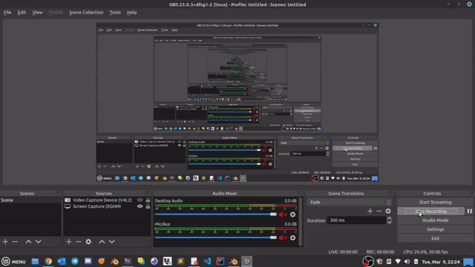

# :classical_building: Trabalho de Conclusão de Curso

## Geração procedural de modelos arquiteturais com geometria arredondada utilizando Selection Expressions (SELEX)

Trabalho de Conclusão de Curso apresentado ao Curso de Graduação em Ciência da Computação do Campus de Crateús da Universidade Federal do Ceará, como requisito parcial à obtenção do grau de bacharel em Ciência da Computação.

### Orientação

**Orientador:** Me. Arnaldo Barreto [[Lattes]](http://lattes.cnpq.br/1606649864930891)

**Coorientador:** Me. Ítalo Ribeiro [[Lattes]](http://lattes.cnpq.br/9204463813833604)

### Banca

- **TCC I:**

  - Prof. Me. Lisieux Marie M. dos Santos Andrade (UFC - Campus Crateús) [[Lattes]](http://lattes.cnpq.br/8824525263721786)
  - Prof. Dr. Markos Oliveira Freitas (UFC - Campus Quixadá) [[Lattes]](http://lattes.cnpq.br/2928195010235502)

- **TCC II:**

  - Prof. Me. Lisieux Marie M. dos Santos Andrade (UFC - Campus Crateús) [[Lattes]](http://lattes.cnpq.br/8824525263721786)
  - Prof. Dr. Joaquim Bento Cavalcante Neto (UFC - Campus Pici) [[Lattes]](http://lattes.cnpq.br/0866205347972203)

---

### 🇧🇷 Resumo

Modelar ambientes virtuais é uma tarefa árdua, podendo requerer grande tempo e esforço da parte dos artistas, se estes optarem por gerar cada objeto manualmente. Baseado nisto, a modelagem procedural surgiu com a proposta de trazer alguns benefícios no que se refere à geração das diversas camadas de ambientes virtuais, como vegetação, terrenos, estradas, rios, edifícios e cidades, por exemplo. Tais modelos, por sua vez, podem ser aplicados em diversos cenários, como planejamento urbano, jogos, filmes, simulações, entre outros. Entretanto, também surgiram alguns desafios, como a falta de intuitividade na utilização de alguns frameworks existentes, a semântica em relação à disposição dos elementos nos modelos, o grau de realismo com que eles são apresentados, e a geração de formas mais complexas, como estruturas arredondadas. Diversas pesquisas tentam mitigar tais dificuldades, assim, seguindo esta premissa, o presente trabalho descreve uma abordagem para a resolução do problema da geração de modelos arquiteturais com geometria arredondada utilizando SELEX, por meio da aplicação de técnicas de deformação, permitindo o arredondamento de estruturas no sentido externo e interno.

**Palavras-chave:** Ambientes virtuais. Modelagem procedural. Modelagem arquitetural. Gramáticas. Selection Expressions. Deformação.

---

### 🇺🇸 Abstract

Modeling virtual environments is an arduous task, and might require great time and effort on the part of the artists if they choose to generate each object manually. Based on this, the procedural modeling came up with the proposal to bring some benefits with regard to the generation of the various layers of virtual environments, such as vegetation, land, roads, rivers, buildings, and cities, for example. Such models, in turn, can be applied in various scenarios, such as urban planning, games, movies, simulations, among others. However, some challenges also emerged, such as the lack of intuitiveness in the use of some existing frameworks, the semantics in relation to the layout of elements in the models, the degree of realism with which they are displayed, and the generation of more complex forms, such as rounded structures. Several researches try to mitigate these challenges, thereby following this premise, the present work describes an approach to solve the problem of generating architectural models with rounded geometry using SELEX, through the application of deformation techniques, allowing the rounding of structures in the external and internal directions.

**Keywords:** Virtual environments. Procedural modeling. Architectural modeling. Grammars. Selection Expressions. Deformation.

---

### 📃 Trabalho

O arquivo do trabalho final pode ser encontrado [aqui](https://github.com/DanielBrito/monografia/blob/main/TCC%20-%20Daniel%20Brito/TCCII_Daniel_Brito.pdf).

---

### ▶️ Apresentação

Os slides das apresentações de TCC I e II podem ser encontrados [aqui](https://github.com/DanielBrito/monografia/blob/main/Apresentacoes).

---

### 📺 Defesa

O vídeo da defesa pode ser encontrado no [YouTube](https://www.youtube.com/watch?v=oTeyrTvo4-s).

---

### ☑️ Prévia

A imagem abaixo ilustra variações de modelos produzidos pela solução proposta. Exemplos mais detalhados podem ser encontrados em [Resultados](Resultados).

---

### 🐞 Bugs

Este é um projeto open source. Sinta-se à vontade para abrir [issues](https://github.com/DanielBrito/monografia/issues) e reportar bugs, se possível, demonstrando a regra utilizada na geração do modelo desejado. Outras sugestões de melhorias também são bem-vindas.
