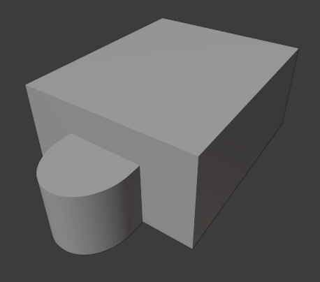

<h1 align="center">Modelo 01</h2>

<h2 align="center">📝 rules_1.slx</h2>

#### **_\#C1: Initial settings_**

_label = "building"; width = 9; depth = 11; height = 5;_

#### **_\#C2: Generating mass model_**

_{<> -> createShape(label, width, depth, height)};_

\# GRID:

#### **_\#C3: Adding virtual shape to the mass model_**

_{< descendant() [label=="building"] / [label=="building_front"] > -> createGrid("main_front_grid", 3, 7)};_

\# DEFORMATION:

#### **_\#C4: Selecting region and performing extrusion_**

_{< descendant() [label=="building"] / [label=="building_front"] / [label=="main_front_grid"] / [type=="cell"] [rowIdx in (2, 3)] [colIdx in (3, 4, 5)] [::groupRegions()] > -> addVolume("entrance", "building_front", 3, ["entrance_front", "entrance_left", "entrance_right"])};_

#### **_\#C5: Applying roundShape deformation_**

_{< descendant() [label=="building"] / [label=="building_front"] / [label=="entrance"] / [label=="entrance_front"] > -> roundShape("front", "outside", 0.42, 30, "main_front", "vertical")};_

---

<h2 align="center">🏢 Resultado</h2>

  

