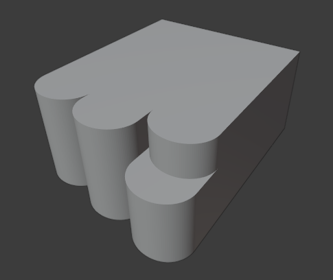

<h1 align="center">Modelo 02</h2>

<h2 align="center">📝 rules_2.slx</h2>

#### **_\#C1: Initial settings_**

_label = "building"; width = 9; depth = 8; height = 5;_

#### **_\#C2: Generating mass model_**

_{<> -> createShape("building", width, depth, height)};_

\# GRID:

#### **_\#C3: Adding virtual shape to the mass model_**

_{< descendant() [label=="building"] / [label=="building_front"] > -> createGrid("main_front_grid", 3, 6)};_

\# DEFORMATION:

#### **_\#C4: Selecting region and performing extrusion_**

_{< descendant() [label=="building"] / [label=="building_front"] / [label=="main_front_grid"] / [type=="cell"] [rowIdx in (1, 2, 3)] [colIdx in (1, 2)] [::groupRegions()] > -> addVolume("facade_1", "building_front", 2.5, ["facade_1_front", "facade_1_left", "facade_1_right"])};_

#### **_\#C5: Applying roundShape deformation_**

_{< descendant() [label=="building"] / [label=="building_front"] / [label=="facade_1"] / [label=="facade_1_front"] > -> roundShape("front", "outside", 0.33, 30, "main_front", "vertical")};_

#### **_\#C6: Selecting region and performing extrusion_**

_{< descendant() [label=="building"] / [label=="building_front"] / [label=="main_front_grid"] / [type=="cell"] [rowIdx in (1, 2, 3)] [colIdx in (3, 4)] [::groupRegions()] > -> addVolume("facade_2", "building_front", 3, ["facade_2_front", "facade_2_left", "facade_2_right"])};_

#### **_\#C7: Applying roundShape deformation_**

_{< descendant() [label=="building"] / [label=="building_front"] / [label=="facade_2"] / [label=="facade_2_front"] > -> roundShape("front", "outside", 0.33, 30, "main_front", "vertical")};_

#### **_\#C8: Selecting region and performing extrusion_**

_{< descendant() [label=="building"] / [label=="building_front"] / [label=="main_front_grid"] / [type=="cell"] [rowIdx in (2, 3)] [colIdx in (5, 6)] [::groupRegions()] > -> addVolume("facade_3", "building_front", 3.5, ["facade_3_front", "facade_3_left", "facade_3_right"])};_

#### **_\#C9: Applying roundShape deformation_**

_{< descendant() [label=="building"] / [label=="building_front"] / [label=="facade_3"] / [label=="facade_3_front"] > -> roundShape("front", "outside", 0.33, 30, "main_front", "vertical")};_

#### **_\#C10: Selecting region and performing extrusion_**

_{< descendant() [label=="building"] / [label=="building_front"] / [label=="main_front_grid"] / [type=="cell"] [rowIdx in (1)] [colIdx in (5, 6)] [::groupRegions()] > -> addVolume("facade_top", "building_front", 2, ["facade_top_front", "facade_top_left", "facade_top_right"])};_

#### **_\#C11: Applying roundShape deformation_**

_{< descendant() [label=="building"] / [label=="building_front"] / [label=="facade_top"] / [label=="facade_top_front"] > -> roundShape("front", "outside", 0.33, 30, "main_front", "vertical")};_

---

<h2 align="center">🏢 Resultado</h2>

  

