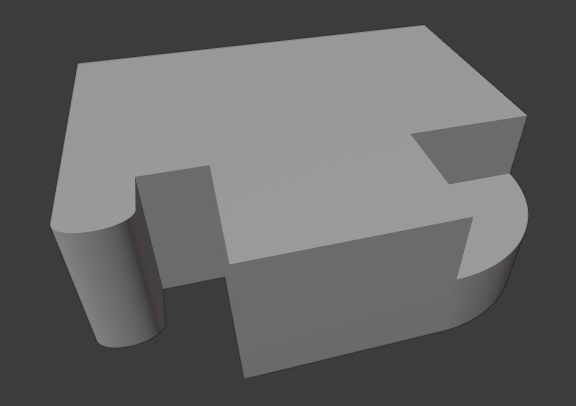

<h1 align="center">Modelo 03</h2>

<h2 align="center">📝 rules_3.slx</h2>

#### **_\#C1: Initial settings_**

_label = "building"; width = 15; depth = 8; height = 5;_

#### **_\#C2: Generating mass model_**

_{<> -> createShape("building", width, depth, height)};_

\# GRID:

#### **_\#C3: Adding virtual shape to the mass model_**

_{< descendant() [label=="building"] / [label=="building_front"] > -> createGrid("main_front_grid", 6, 7)};_

\# DEFORMATION:

#### **_\#C4: Selecting region and performing extrusion_**

_{< descendant() [label=="building"] / [label=="building_front"] / [label=="main_front_grid"] / [type=="cell"] [rowIdx in (1, 2, 3, 4, 5, 6)] [colIdx in (1)] [::groupRegions()] > -> addVolume("entrance_1", "building_front", 2, ["entrance_1_front", "entrance_1_left", "entrance_1_right"])};_

#### **_\#C5: Applying roundShape deformation_**

_{< descendant() [label=="building"] / [label=="building_front"] / [label=="entrance_1"] / [label=="entrance_1_front"] > -> roundShape("front", "outside", 0.14, 30, "main_front", "vertical")};_

#### **_\#C6: Selecting region and performing extrusion_**

_{< descendant() [label=="building"] / [label=="building_front"] / [label=="main_front_grid"] / [type=="cell"] [rowIdx in (1, 2, 3, 4, 5, 6)] [colIdx in (3, 4, 5)] [::groupRegions()] > -> addVolume("entrance_2", "building_front", 4, ["entrance_2_front", "entrance_2_left", "entrance_2_right"])};_

#### **_\#C7: Selecting region and performing extrusion_**

_{< descendant() [label=="building"] / [label=="building_front"] / [label=="main_front_grid"] / [type=="cell"] [rowIdx in (4, 5, 6)] [colIdx in (6, 7)] [::groupRegions()] > -> addVolume("entrance_3", "building_front", 4, ["entrance_3_front", "entrance_3_left", "entrance_3_right"])};_

#### **_\#C8: Applying roundShape deformation_**

_{< descendant() [label=="building"] / [label=="building_front"] / [label=="entrance_3"] / [label=="entrance_3_front"] > -> roundShape("right", "outside", 1, 30, "main_front")};_

---

<h2 align="center">🏢 Resultado</h2>

  

