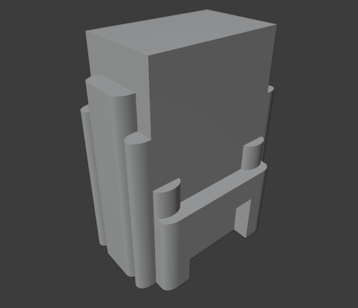

<h1 align="center">Modelo 04</h2>

<h2 align="center">📝 rules_4.slx</h2>

#### **_\#C1: Initial settings_**

_label = "building"; width = 5; depth = 8; height = 13;_

#### **_\#C2: Generating mass model_**

_{<> -> createShape("building", width, depth, height)};_

\# GRIDS:

#### **_\#C3: Adding virtual shape to the mass model_**

_{< descendant() [label=="building"] / [label=="building_front"] > -> createGrid("main_front_grid", 7, 10)};_

#### **_\#C4: Adding virtual shape to the mass model_**

_{< descendant() [label=="building"] / [label=="building_back"] > -> createGrid("main_back_grid", 7, 10)};_

#### **_\#C5: Adding virtual shape to the mass model_**

_{< descendant() [label=="building"] / [label=="building_left"] > -> createGrid("main_left_grid", 8, 10)};_

#### **_\#C6: Adding virtual shape to the mass model_**

_{< descendant() [label=="building"] / [label=="building_right"] > -> createGrid("main_right_grid", 8, 10)};_

\# FRONT DEFORMATION:

#### **_\#C7: Selecting region and performing extrusion_**

_{< descendant() [label=="building"] / [label=="building_front"] / [label=="main_front_grid"] / [type=="cell"] [rowIdx in (3, 4, 5, 6, 7)] [colIdx in (1, 2)] [::groupRegions()] > -> addVolume("south_1", "building_front", 1, ["south_1_front", "south_1_left", "south_1_right"])};_

#### **_\#C8: Applying roundShape deformation_**

_{< descendant() [label=="building"] / [label=="building_front"] / [label=="south_1"] / [label=="south_1_front"] > -> roundShape("front", "outside", 0.2, 30, "main_front", "vertical")};_

#### **_\#C9: Selecting region and performing extrusion_**

_{< descendant() [label=="building"] / [label=="building_front"] / [label=="main_front_grid"] / [type=="cell"] [rowIdx in (3, 4, 5, 6, 7)] [colIdx in (9, 10)] [::groupRegions()] > -> addVolume("south_2", "building_front", 1, ["south_2_front", "south_2_left", "south_2_right"])};_

#### **_\#C10: Applying roundShape deformation_**

_{< descendant() [label=="building"] / [label=="building_front"] / [label=="south_2"] / [label=="south_2_front"] > -> roundShape("front", "outside", 0.2, 30, "main_front", "vertical")};_

#### **_\#C11: Selecting region and performing extrusion_**

_{< descendant() [label=="building"] / [label=="building_front"] / [label=="main_front_grid"] / [type=="cell"] [rowIdx in (2, 3, 4, 5, 6, 7)] [colIdx in (3, 4, 5, 6, 7, 8)] [::groupRegions()] > -> addVolume("south_3", "building_front", 1, ["south_3_front", "south_3_left", "south_3_right"])};_

#### **_\#C12: Applying roundShape deformation_**

_{< descendant() [label=="building"] / [label=="building_front"] / [label=="south_3"] / [label=="south_3_front"] > -> roundShape("front", "outside", 0.2, 30, "main_front", "vertical")};_

\# RIGHT DEFORMATION:

#### **_\#C13: Selecting region and performing extrusion_**

_{< descendant() [label=="building"] / [label=="building_right"] / [label=="main_right_grid"] / [type=="cell"] [rowIdx in (6, 7, 8)] [colIdx in (1, 2)] [::groupRegions()] > -> addVolume("east_1", "building_right", 1, ["east_1_front", "east_1_left", "east_1_right"])};_

#### **_\#C14: Applying roundShape deformation_**

_{< descendant() [label=="building"] / [label=="building_right"] / [label=="east_1"] / [label=="east_1_front"] > -> roundShape("left", "outside", 0.2, 30, "main_right")};_

#### **_\#C15: Selecting region and performing extrusion_**

_{< descendant() [label=="building"] / [label=="building_right"] / [label=="main_right_grid"] / [type=="cell"] [rowIdx in (6, 7, 8)] [colIdx in (9, 10)] [::groupRegions()] > -> addVolume("east_2", "building_right", 1, ["east_2_front", "east_2_left", "east_2_right"])};_

#### **_\#C16: Applying roundShape deformation_**

_{< descendant() [label=="building"] / [label=="building_right"] / [label=="east_2"] / [label=="east_2_front"] > -> roundShape("right", "outside", 0.2, 30, "main_right")};_

#### **_\#C17: Selecting region and performing extrusion_**

_{< descendant() [label=="building"] / [label=="building_right"] / [label=="main_right_grid"] / [type=="cell"] [rowIdx in (6)] [colIdx in (3, 4, 5, 6, 7, 8)] [::groupRegions()] > -> addVolume("east_3", "building_right", 1, ["east_3_front", "east_3_left", "east_2_right"])};_

#### **_\#C18: Selecting region and performing extrusion_**

_{< descendant() [label=="building"] / [label=="building_right"] / [label=="main_right_grid"] / [type=="cell"] [rowIdx in (5)] [colIdx in (1, 2)] [::groupRegions()] > -> addVolume("east_4", "building_right", 0.5, ["east_4_front", "east_4_left", "east_4_right"])};_

#### **_\#C19: Applying roundShape deformation_**

_{< descendant() [label=="building"] / [label=="building_right"] / [label=="east_4"] / [label=="east_4_front"] > -> roundShape("front", "outside", 0.2, 30, "main_right", "vertical")};_

#### **_\#C20: Selecting region and performing extrusion_**

_{< descendant() [label=="building"] / [label=="building_right"] / [label=="main_right_grid"] / [type=="cell"] [rowIdx in (5)] [colIdx in (9, 10)] [::groupRegions()] > -> addVolume("east_5", "building_right", 0.5, ["east_5_front", "east_5_left", "east_5_right"])};_

#### **_\#C21: Applying roundShape deformation_**

_{< descendant() [label=="building"] / [label=="building_right"] / [label=="east_5"] / [label=="east_5_front"] > -> roundShape("front", "outside", 0.2, 30, "main_right", "vertical")};_

\# BACK DEFORMATION:

#### **_\#C22: Selecting region and performing extrusion_**

_{< descendant() [label=="building"] / [label=="building_back"] / [label=="main_back_grid"] / [type=="cell"] [rowIdx in (3, 4, 5, 6, 7)] [colIdx in (1, 2)] [::groupRegions()] > -> addVolume("north_1", "building_back", 1, ["north_1_front", "north_1_left", "north_1_right"])};_

#### **_\#C23: Applying roundShape deformation_**

_{< descendant() [label=="building"] / [label=="building_back"] / [label=="north_1"] / [label=="north_1_front"] > -> roundShape("front", "outside", 0.2, 30, "main_back", "vertical")};_

#### **_\#C24: Selecting region and performing extrusion_**

_{< descendant() [label=="building"] / [label=="building_back"] / [label=="main_back_grid"] / [type=="cell"] [rowIdx in (3, 4, 5, 6, 7)] [colIdx in (9, 10)] [::groupRegions()] > -> addVolume("north_2", "building_back", 1, ["north_2_front", "north_2_left", "north_2_right"])};_

#### **_\#C25: Applying roundShape deformation_**

_{< descendant() [label=="building"] / [label=="building_back"] / [label=="north_2"] / [label=="north_2_front"] > -> roundShape("front", "outside", 0.2, 30, "main_back", "vertical")};_

#### **_\#C26: Selecting region and performing extrusion_**

_{< descendant() [label=="building"] / [label=="building_back"] / [label=="main_back_grid"] / [type=="cell"] [rowIdx in (2, 3, 4, 5, 6, 7)] [colIdx in (3, 4, 5, 6, 7, 8)] [::groupRegions()] > -> addVolume("north_3", "building_back", 1, ["north_3_front", "north_3_left", "north_3_right"])};_

#### **_\#C27: Applying roundShape deformation_**

_{< descendant() [label=="building"] / [label=="building_back"] / [label=="north_3"] / [label=="north_3_front"] > -> roundShape("front", "outside", 0.2, 30, "main_back", "vertical")};_

\# LEFT DEFORMATION:

#### **_\#C28: Selecting region and performing extrusion_**

_{< descendant() [label=="building"] / [label=="building_left"] / [label=="main_left_grid"] / [type=="cell"] [rowIdx in (6, 7, 8)] [colIdx in (1, 2)] [::groupRegions()] > -> addVolume("west_1", "building_left", 1, ["west_1_front", "west_1_left", "west_1_right"])};_

#### **_\#C29: Applying roundShape deformation_**

_{< descendant() [label=="building"] / [label=="building_left"] / [label=="west_1"] / [label=="west_1_front"] > -> roundShape("left", "outside", 0.2, 30, "main_left")};_

#### **_\#C30: Selecting region and performing extrusion_**

_{< descendant() [label=="building"] / [label=="building_left"] / [label=="main_left_grid"] / [type=="cell"] [rowIdx in (6, 7, 8)] [colIdx in (9, 10)] [::groupRegions()] > -> addVolume("west_2", "building_left", 1, ["west_2_front", "west_2_left", "west_2_right"])};_

#### **_\#C31: Applying roundShape deformation_**

_{< descendant() [label=="building"] / [label=="building_left"] / [label=="west_2"] / [label=="west_2_front"] > -> roundShape("right", "outside", 0.2, 30, "main_left")};_

#### **_\#C32: Selecting region and performing extrusion_**

_{< descendant() [label=="building"] / [label=="building_left"] / [label=="main_left_grid"] / [type=="cell"] [rowIdx in (6)] [colIdx in (3, 4, 5, 6, 7, 8)] [::groupRegions()] > -> addVolume("west_3", "building_left", 1, ["west_3_front", "west_3_left", "west_2_right"])};_

#### **_\#C33: Selecting region and performing extrusion_**

_{< descendant() [label=="building"] / [label=="building_left"] / [label=="main_left_grid"] / [type=="cell"] [rowIdx in (5)] [colIdx in (1, 2)] [::groupRegions()] > -> addVolume("west_4", "building_left", 0.5, ["west_4_front", "west_4_left", "west_4_right"])};_

#### **_\#C34: Applying roundShape deformation_**

_{< descendant() [label=="building"] / [label=="building_left"] / [label=="west_4"] / [label=="west_4_front"] > -> roundShape("front", "outside", 0.2, 30, "main_left", "vertical")};_

#### **_\#C35: Selecting region and performing extrusion_**

_{< descendant() [label=="building"] / [label=="building_left"] / [label=="main_left_grid"] / [type=="cell"] [rowIdx in (5)] [colIdx in (9, 10)] [::groupRegions()] > -> addVolume("left_5", "building_left", 0.5, ["west_5_front", "west_5_left", "west_5_right"])};_

#### **_\#C36: Applying roundShape deformation_**

_{< descendant() [label=="building"] / [label=="building_left"] / [label=="west_5"] / [label=="west_5_front"] > -> roundShape("front", "outside", 0.2, 30, "main_left", "vertical")};_

---

<h2 align="center">🏢 Resultado</h2>

  

