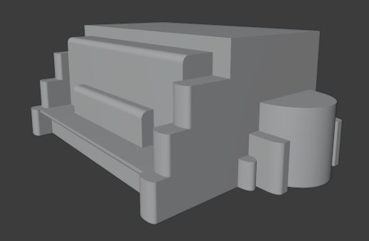

<h1 align="center">Modelo 05</h2>

<h2 align="center">📝 rules_5.slx</h2>

#### **_\#C1: Initial settings_**

_label = "building"; width = 20; depth = 10; height = 10;_

#### **_\#C2: Generating mass model_**

_{<> -> createShape("building", width, depth, height)};_

\# GRIDS:

#### **_\#C3: Adding virtual shape to the mass model_**

_{< descendant() [label=="building"] / [label=="building_front"] > -> createGrid("main_front_grid", 20, 13)};_

#### **_\#C4: Adding virtual shape to the mass model_**

_{< descendant() [label=="building"] / [label=="building_back"] > -> createGrid("main_back_grid", 20, 13)};_

#### **_\#C5: Adding virtual shape to the mass model_**

_{< descendant() [label=="building"] / [label=="building_left"] > -> createGrid("main_left_grid", 20, 10)};_

#### **_\#C6: Adding virtual shape to the mass model_**

_{< descendant() [label=="building"] / [label=="building_right"] > -> createGrid("main_right_grid", 20, 10)};_

\# FRONT DEFORMATION:

#### **_\#C7: Selecting region and performing extrusion_**

_{< descendant() [label=="building"] / [label=="building_front"] / [label=="main_front_grid"] / [type=="cell"] [rowIdx in (16, 17, 18, 19, 20)] [colIdx in (1)] [::groupRegions()] > -> addVolume("south_1", "building_front", 6, ["south_1_front", "south_1_left", "south_1_right"])};_

#### **_\#C8: Applying roundShape deformation_**

_{< descendant() [label=="building"] / [label=="building_front"] / [label=="south_1"] / [label=="south_1_front"] > -> roundShape("front", "outside", 0.07, 30, "main_front", "vertical")};_

#### **_\#C9: Selecting region and performing extrusion_**

_{< descendant() [label=="building"] / [label=="building_front"] / [label=="main_front_grid"] / [type=="cell"] [rowIdx in (16, 17, 18, 19, 20)] [colIdx in (13)] [::groupRegions()] > -> addVolume("south_2", "building_front", 6, ["south_2_front", "south_2_left", "south_2_right"])};_

#### **_\#C10: Applying roundShape deformation_**

_{< descendant() [label=="building"] / [label=="building_front"] / [label=="south_2"] / [label=="south_2_front"] > -> roundShape("front", "outside", 0.07, 30, "main_front", "vertical")};_

#### **_\#C11: Selecting region and performing extrusion_**

_{< descendant() [label=="building"] / [label=="building_front"] / [label=="main_front_grid"] / [type=="cell"] [rowIdx in (17, 18, 19, 20)] [colIdx in (2, 3, 4, 5, 6, 7, 8, 9, 10, 11, 12)] [::groupRegions()] > -> addVolume("south_3", "building_front", 4.5, ["south_3_front", "south_3_left", "south_3_right"])};_

#### **_\#C12: Selecting region and performing extrusion_**

_{< descendant() [label=="building"] / [label=="building_front"] / [label=="main_front_grid"] / [type=="cell"] [rowIdx in (16)] [colIdx in (2, 3, 4, 5, 6, 7, 8, 9, 10, 11, 12)] [::groupRegions()] > -> addVolume("south_4", "building_front", 5.5, ["south_4_front", "south_4_left", "south_4_right"])};_

#### **_\#C13: Applying roundShape deformation_**

_{< descendant() [label=="building"] / [label=="building_front"] / [label=="south_4"] / [label=="south_4_front"] > -> roundShape("bottom", "outside", 0.07, 30, "main_front")};_

#### **_\#C14: Selecting region and performing extrusion_**

_{< descendant() [label=="building"] / [label=="building_front"] / [label=="main_front_grid"] / [type=="cell"] [rowIdx in (11, 12, 13, 14, 15)] [colIdx in (1)] [::groupRegions()] > -> addVolume("south_5", "building_front", 5, ["south_5_front", "south_5_left", "south_5_right"])};_

#### **_\#C15: Applying roundShape deformation_**

_{< descendant() [label=="building"] / [label=="building_front"] / [label=="south_5"] / [label=="south_5_front"] > -> roundShape("front", "outside", 0.07, 30, "main_front", "vertical")};_

#### **_\#C16: Selecting region and performing extrusion_**

_{< descendant() [label=="building"] / [label=="building_front"] / [label=="main_front_grid"] / [type=="cell"] [rowIdx in (11, 12, 13, 14, 15)] [colIdx in (13)] [::groupRegions()] > -> addVolume("south_6", "building_front", 5, ["south_6_front", "south_6_left", "south_6_right"])};_

#### **_\#C17: Applying roundShape deformation_**

_{< descendant() [label=="building"] / [label=="building_front"] / [label=="south_6"] / [label=="south_6_front"] > -> roundShape("front", "outside", 0.07, 30, "main_front", "vertical")};_

#### **_\#C18: Selecting region and performing extrusion_**

_{< descendant() [label=="building"] / [label=="building_front"] / [label=="main_front_grid"] / [type=="cell"] [rowIdx in (3, 4, 5, 6, 7, 8, 9, 10, 11, 12, 13, 14, 15)] [colIdx in (2, 3, 4, 5, 6, 7, 8, 9, 10, 11, 12)] [::groupRegions()] > -> addVolume("south_7", "building_front", 2.5, ["south_7_front", "south_7_left", "south_7_right"])};_

#### **_\#C19: Applying roundShape deformation_**

_{< descendant() [label=="building"] / [label=="building_front"] / [label=="south_7"] / [label=="south_10_front"] > -> roundShape("top", "outside", 0.1, 30, "main_front")};_

#### **_\#C20: Selecting region and performing extrusion_**

_{< descendant() [label=="building"] / [label=="building_front"] / [label=="main_front_grid"] / [type=="cell"] [rowIdx in (11, 12, 13, 14, 15)] [colIdx in (4, 5, 6, 7, 8, 9, 10)] [::groupRegions()] > -> addVolume("south_10", "building_front", 3.5, ["south_10_front", "south_10_left", "south_10_right"])};_

#### **_\#C21: Applying roundShape deformation_**

_{< descendant() [label=="building"] / [label=="building_front"] / [label=="south_7"] / [label=="south_7_front"] > -> roundShape("top", "outside", 0.1, 30, "main_front")};_

#### **_\#C22: Selecting region and performing extrusion_**

_{< descendant() [label=="building"] / [label=="building_front"] / [label=="main_front_grid"] / [type=="cell"] [rowIdx in (6, 7, 8, 9, 10)] [colIdx in (1)] [::groupRegions()] > -> addVolume("south_8", "building_front", 3.5, ["south_8_front", "south_8_left", "south_8_right"])};_

#### **_\#C23: Applying roundShape deformation_**

_{< descendant() [label=="building"] / [label=="building_front"] / [label=="south_8"] / [label=="south_8_front"] > -> roundShape("front", "outside", 0.07, 30, "main_front", "vertical")};_

#### **_\#C24: Selecting region and performing extrusion_**

_{< descendant() [label=="building"] / [label=="building_front"] / [label=="main_front_grid"] / [type=="cell"] [rowIdx in (6, 7, 8, 9, 10)] [colIdx in (13)] [::groupRegions()] > -> addVolume("south_9", "building_front", 3.5, ["south_9_front", "south_9_left", "south_9_right"])};_

#### **_\#C25: Applying roundShape deformation_**

_{< descendant() [label=="building"] / [label=="building_front"] / [label=="south_9"] / [label=="south_9_front"] > -> roundShape("front", "outside", 0.07, 30, "main_front", "vertical")};_

\# RIGHT DEFORMATION:

#### **_\#C26: Selecting region and performing extrusion_**

_{< descendant() [label=="building"] / [label=="building_right"] / [label=="main_right_grid"] / [type=="cell"] [rowIdx in (17, 18, 19, 20)] [colIdx in (2)] [::groupRegions()] > -> addVolume("east_1", "building_right", 1, ["east_1_front", "east_1_left", "east_1_right"])};_

#### **_\#C27: Applying roundShape deformation_**

_{< descendant() [label=="building"] / [label=="building_right"] / [label=="east_1"] / [label=="east_1_front"] > -> roundShape("front", "outside", 0.09, 30, "main_right", "vertical")};_

#### **_\#C28: Selecting region and performing extrusion_**

_{< descendant() [label=="building"] / [label=="building_right"] / [label=="main_right_grid"] / [type=="cell"] [rowIdx in (14, 15, 16, 17, 18, 19, 20)] [colIdx in (3)] [::groupRegions()] > -> addVolume("east_2", "building_right", 2.5, ["east_2_front", "east_2_left", "east_2_right"])};_

#### **_\#C29: Applying roundShape deformation_**

_{< descendant() [label=="building"] / [label=="building_right"] / [label=="east_2"] / [label=="east_2_front"] > -> roundShape("left", "outside", 0.09, 30, "main_right")};_

#### **_\#C30: Selecting region and performing extrusion_**

_{< descendant() [label=="building"] / [label=="building_right"] / [label=="main_right_grid"] / [type=="cell"] [rowIdx in (14, 15, 16, 17, 18, 19, 20)] [colIdx in (10)] [::groupRegions()] > -> addVolume("east_3", "building_right", 2.5, ["east_3_front", "east_3_left", "east_3_right"])};_

#### **_\#C31: Applying roundShape deformation_**

_{< descendant() [label=="building"] / [label=="building_right"] / [label=="east_3"] / [label=="east_3_front"] > -> roundShape("right", "outside", 0.09, 30, "main_right")};_

#### **_\#C32: Selecting region and performing extrusion_**

_{< descendant() [label=="building"] / [label=="building_right"] / [label=="main_right_grid"] / [type=="cell"] [rowIdx in (10, 11, 12, 13, 14, 15, 16, 17, 18, 19, 20)] [colIdx in (4, 5, 6, 7, 8, 9)] [::groupRegions()] > -> addVolume("east_4", "building_right", 3.5, ["east_4_front", "east_4_left", "east_4_right"])};_

#### **_\#C33: Applying roundShape deformation_**

_{< descendant() [label=="building"] / [label=="building_right"] / [label=="east_4"] / [label=="east_4_front"] > -> roundShape("front", "outside", 0.6, 30, "main_right", "vertical")};_

---

<h2 align="center">🏢 Resultado</h2>

  

