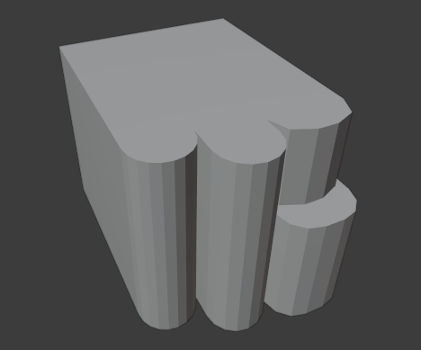

<h1 align="center">Modelo 08</h2>

<h2 align="center">📝 rules_8.slx</h2>

#### **_\#C1: Initial settings_**

_label = "building"; width = 10; depth = 10; height = 10;_

#### **_\#C2: Generating mass model_**

_{<> -> createShape("building", width, depth, height)};_

\# GRIDS:

#### **_\#C3: Adding virtual shape to the mass model_**

_{< descendant() [label=="building"] / [label=="building_front"] > -> createGrid("main_front_grid", 10, 10)};_

#### **_\#C4: Adding virtual shape to the mass model_**

_{< descendant() [label=="building"] / [label=="building_back"] > -> createGrid("main_back_grid", 10, 10)};_

#### **_\#C5: Adding virtual shape to the mass model_**

_{< descendant() [label=="building"] / [label=="building_left"] > -> createGrid("main_left_grid", 10, 10)};_

#### **_\#C6: Adding virtual shape to the mass model_**

_{< descendant() [label=="building"] / [label=="building_right"] > -> createGrid("main_right_grid", 10, 10)};_

\# FRONT DEFORMATION

#### **_\#C7: Selecting region and performing extrusion_**

_{< descendant() [label=="building"] / [label=="building_front"] / [label=="main_front_grid"] / [type=="cell"] [rowIdx in (1, 2, 3, 4, 5, 6, 7, 8, 9, 10)] [colIdx in (1, 2, 3)] [::groupRegions()] > -> addVolume("south_1", "building_front", 2, ["south_1_front", "south_1_left", "south_1_right"])};_

#### **_\#C8: Applying roundShape deformation_**

_{< descendant() [label=="building"] / [label=="building_front"] / [label=="south_1"] / [label=="south_1_front"] > -> roundShape("front", "outside", 0.3, 5, "main_front", "vertical")};_

#### **_\#C9: Selecting region and performing extrusion_**

_{< descendant() [label=="building"] / [label=="building_front"] / [label=="main_front_grid"] / [type=="cell"] [rowIdx in (1, 2, 3, 4, 5, 6, 7, 8, 9, 10)] [colIdx in (4, 5, 6)] [::groupRegions()] > -> addVolume("south_2", "building_front", 3.5, ["south_2_front", "south_2_left", "south_2_right"])};_

#### **_\#C10: Applying roundShape deformation_**

_{< descendant() [label=="building"] / [label=="building_front"] / [label=="south_2"] / [label=="south_2_front"] > -> roundShape("front", "outside", 0.3, 4, "main_front", "vertical")};_

#### **_\#C11: Selecting region and performing extrusion_**

_{< descendant() [label=="building"] / [label=="building_front"] / [label=="main_front_grid"] / [type=="cell"] [rowIdx in (5, 6, 7, 8, 9, 10)] [colIdx in (7, 8, 9, 10)] [::groupRegions()] > -> addVolume("south_3", "building_front", 4, ["south_3_front", "south_3_left", "south_3_right"])};_

#### **_\#C12: Applying roundShape deformation_**

_{< descendant() [label=="building"] / [label=="building_front"] / [label=="south_3"] / [label=="south_3_front"] > -> roundShape("front", "outside", 0.3, 3, "main_front", "vertical")};_

#### **_\#C13: Selecting region and performing extrusion_**

_{< descendant() [label=="building"] / [label=="building_front"] / [label=="main_front_grid"] / [type=="cell"] [rowIdx in (1, 2, 3, 4)] [colIdx in (7, 8, 9, 10)] [::groupRegions()] > -> addVolume("south_4", "building_front", 2.5, ["south_4_front", "south_4_left", "south_4_right"])};_

#### **_\#C14: Applying roundShape deformation_**

_{< descendant() [label=="building"] / [label=="building_front"] / [label=="south_4"] / [label=="south_4_front"] > -> roundShape("front", "outside", 0.3, 2, "main_front", "vertical")};_

---

<h2 align="center">🏢 Resultado</h2>

  

