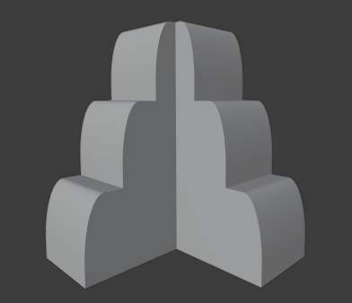

<h1 align="center">Modelo 09</h2>

<h2 align="center">📝 rules_9.slx</h2>

#### **_\#C1: Initial settings_**

_label = "building"; width = 3; depth = 3; height = 3;_

#### **_\#C2: Generating mass model_**

_{<> -> createShape("building", width, depth, height)};_

\# GRIDS:

#### **_\#C3: Adding virtual shape to the mass model_**

_{< descendant() [label=="building"] / [label=="building_front"] > -> createGrid("main_front_grid", 5, 3)};_

#### **_\#C4: Adding virtual shape to the mass model_**

_{< descendant() [label=="building"] / [label=="building_back"] > -> createGrid("main_back_grid", 5, 3)};_

#### **_\#C5: Adding virtual shape to the mass model_**

_{< descendant() [label=="building"] / [label=="building_left"] > -> createGrid("main_left_grid", 5, 3)};_

#### **_\#C6: Adding virtual shape to the mass model_**

_{< descendant() [label=="building"] / [label=="building_right"] > -> createGrid("main_right_grid", 5, 3)};_

\# DEFORMATION:

#### **_\#C7: Selecting region and performing extrusion_**

_{< descendant() [label=="building"] / [label=="building_front"] / [label=="main_front_grid"] / [type=="cell"] [rowIdx in (1, 2, 3, 4, 5)] [colIdx in (1, 2, 3)] [::groupRegions()] > -> addVolume("south_1", "building_front", 2, ["south_1_front", "south_1_left", "south_1_right"])};_

#### **_\#C8: Applying roundShape deformation_**

_{< descendant() [label=="building"] / [label=="building_front"] / [label=="south_1"] / [label=="south_1_front"] > -> roundShape("top", "outside", 1, 30, "main_front", "vertical")};_

#### **_\#C9: Selecting region and performing extrusion_**

_{< descendant() [label=="building"] / [label=="building_left"] / [label=="main_left_grid"] / [type=="cell"] [rowIdx in (1, 2, 3, 4, 5)] [colIdx in (1, 2, 3)] [::groupRegions()] > -> addVolume("west_1", "building_left", 2, ["west_1_front", "west_1_left", "west_1_right"])};_

#### **_\#C10: Applying roundShape deformation_**

_{< descendant() [label=="building"] / [label=="building_left"] / [label=="west_1"] / [label=="west_1_front"] > -> roundShape("top", "outside", 1, 30, "main_left", "vertical")};_

#### **_\#C11: Selecting region and performing extrusion_**

_{< descendant() [label=="building"] / [label=="building_right"] / [label=="main_right_grid"] / [type=="cell"] [rowIdx in (1, 2, 3, 4, 5)] [colIdx in (1, 2, 3)] [::groupRegions()] > -> addVolume("east_1", "building_right", 2, ["east_1_front", "east_1_left", "east_1_right"])};_

#### **_\#C12: Applying roundShape deformation_**

_{< descendant() [label=="building"] / [label=="building_right"] / [label=="east_1"] / [label=="east_1_front"] > -> roundShape("top", "outside", 1, 30, "main_right", "vertical")};_

#### **_\#C13: Selecting region and performing extrusion_**

_{< descendant() [label=="building"] / [label=="building_back"] / [label=="main_back_grid"] / [type=="cell"] [rowIdx in (1, 2, 3, 4, 5)] [colIdx in (1, 2, 3)] [::groupRegions()] > -> addVolume("north_1", "building_back", 2, ["north_1_front", "north_1_left", "north_1_right"])};_

#### **_\#C14: Applying roundShape deformation_**

_{< descendant() [label=="building"] / [label=="building_back"] / [label=="north_1"] / [label=="north_1_front"] > -> roundShape("top", "outside", 1, 30, "main_back", "vertical")};_

---

<h2 align="center">🏢 Resultado</h2>

  

