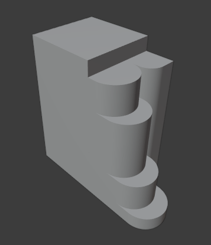

<h1 align="center">Modelo 12</h2>

<h2 align="center">📝 rules_12.slx</h2>

#### **_\#C1: Initial settings_**

_label = "building"; width = 5; depth = 5; height = 10;_

#### **\*\#C2: Generating mass model\*\*\*\***

_{<> -> createShape("building", width, depth, height)};_

\# GRIDS:

#### **_\#C3: Adding virtual shape to the mass model_**

_{< descendant() [label=="building"] / [label=="building_right"] > -> createGrid("main_right_grid", 10, 5)};_

\# DEFORMATION

#### **_\#C4: Selecting region and performing extrusion_**

_{< descendant() [label=="building"] / [label=="building_right"] / [label=="main_right_grid"] / [type=="cell"] [rowIdx in (10)] [colIdx in (1, 2, 3)] [::groupRegions()] > -> addVolume("east_1", "building_right", 5, ["east_1_front", "east_1_left", "east_1_right"])};_

#### **_\#C5: Applying roundShape deformation_**

_{< descendant() [label=="building"] / [label=="building_right"] / [label=="east_1"] / [label=="east_1_front"] > -> roundShape("front", "outside", 0.6, 30, "main_right", "vertical")};_

#### **_\#C6: Selecting region and performing extrusion_**

_{< descendant() [label=="building"] / [label=="building_right"] / [label=="main_right_grid"] / [type=="cell"] [rowIdx in (8, 9)] [colIdx in (1, 2, 3)] [::groupRegions()] > -> addVolume("east_2", "building_right", 4, ["east_2_front", "east_2_left", "east_2_right"])};_

#### **_\#C7: Applying roundShape deformation_**

_{< descendant() [label=="building"] / [label=="building_right"] / [label=="east_2"] / [label=="east_2_front"] > -> roundShape("front", "outside", 0.6, 30, "main_right", "vertical")};_

#### **_\#C8: Selecting region and performing extrusion_**

_{< descendant() [label=="building"] / [label=="building_right"] / [label=="main_right_grid"] / [type=="cell"] [rowIdx in (4, 5, 6, 7)] [colIdx in (1, 2, 3)] [::groupRegions()] > -> addVolume("east_3", "building_right", 3, ["east_3_front", "east_3_left", "east_3_right"])};_

#### **_\#C9: Applying roundShape deformation_**

_{< descendant() [label=="building"] / [label=="building_right"] / [label=="east_3"] / [label=="east_3_front"] > -> roundShape("front", "outside", 0.6, 30, "main_right", "vertical")};_

#### **_\#C10: Selecting region and performing extrusion_**

_{< descendant() [label=="building"] / [label=="building_right"] / [label=="main_right_grid"] / [type=="cell"] [rowIdx in (2, 3)] [colIdx in (1, 2, 3)] [::groupRegions()] > -> addVolume("east_4", "building_right", 2, ["east_4_front", "east_4_left", "east_4_right"])};_

#### **_\#C11: Applying roundShape deformation_**

_{< descendant() [label=="building"] / [label=="building_right"] / [label=="east_4"] / [label=="east_4_front"] > -> roundShape("front", "outside", 0.6, 30, "main_right", "vertical")};_

#### **_\#C12: Selecting region and performing extrusion_**

_{< descendant() [label=="building"] / [label=="building_right"] / [label=="main_right_grid"] / [type=="cell"] [rowIdx in (2, 3, 4, 5, 6, 7, 8, 9, 10)] [colIdx in (4, 5)] [::groupRegions()] > -> addVolume("east_5", "building_right", 2, ["east_5_front", "east_5_left", "east_5_right"])};_

#### **_\#C13: Applying roundShape deformation_**

_{< descendant() [label=="building"] / [label=="building_right"] / [label=="east_5"] / [label=="east_5_front"] > -> roundShape("left", "outside", 0.4, 30, "main_right")};_

---

<h2 align="center">🏢 Resultado</h2>

  

