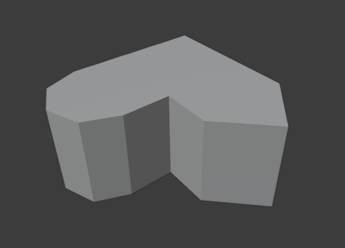

<h1 align="center">Modelo 13</h2>

<h2 align="center">📝 rules_13.slx</h2>

#### **_\#C1: Initial settings_**

_label = "building"; width = 5; depth = 5; height = 5;_

#### **_\#C2: Generating mass model_**

_{<> -> createShape("building", width, depth, height)};_

\# GRIDS

#### **_\#C3: Adding virtual shape to the mass model_**

_{< descendant() [label=="building"] / [label=="building_front"] > -> createGrid("main_front_grid", 5, 5)};_

#### **_\#C4: Adding virtual shape to the mass model_**

_{< descendant() [label=="building"] / [label=="building_right"] > -> createGrid("main_right_grid", 5, 5)};_

\# FRONT

#### **_\#C5: Selecting region and performing extrusion_**

_{< descendant() [label=="building"] / [label=="building_front"] / [label=="main_front_grid"] / [type=="cell"] [rowIdx in (1, 2, 3, 4, 5)] [colIdx in (1, 2, 3, 4, 5)] [::groupRegions()] > -> addVolume("south_1", "building_front", 5, ["south_1_front", "south_1_left", "south_1_right"])};_

#### **_\#C6: Applying roundShape deformation_**

_{< descendant() [label=="building"] / [label=="building_front"] / [label=="south_1"] / [label=="south_1_front"] > -> roundShape("front", "outside", 1, 2, "main_front", "vertical")};_

\# RIGHT

#### **_\#C7: Selecting region and performing extrusion_**

_{< descendant() [label=="building"] / [label=="building_right"] / [label=="main_right_grid"] / [type=="cell"] [rowIdx in (1, 2, 3, 4, 5)] [colIdx in (1, 2, 3, 4, 5)] [::groupRegions()] > -> addVolume("east_1", "building_right", 5, ["east_1_front", "east_1_left", "east_1_right"])};_

#### **_\#C8: Applying roundShape deformation_**

_{< descendant() [label=="building"] / [label=="building_right"] / [label=="east_1"] / [label=="east_1_front"] > -> roundShape("front", "outside", 1, 1, "main_right", "vertical")};_

---

<h2 align="center">🏢 Resultado</h2>

  

