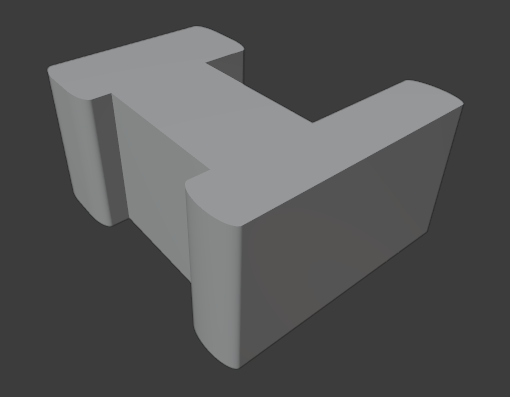

<h1 align="center">Modelo 14</h2>

<h2 align="center">📝 rules_14.slx</h2>

#### **_\#C1: Initial settings_**

_label = "building"; width = 10; depth = 3.5; height = 5;_

#### **_\#C2: Generating mass model_**

_{<> -> createShape("building", width, depth, height)};_

\# GRIDS:

#### **_\#C3: Adding virtual shape to the mass model_**

_{< descendant() [label=="building"] / [label=="building_front"] > -> createGrid("main_front_grid", 5, 10)};_

#### **_\#C4: Adding virtual shape to the mass model_**

_{< descendant() [label=="building"] / [label=="building_back"] > -> createGrid("main_back_grid", 5, 10)};_

\# FRONT:

#### **_\#C5: Selecting region and performing extrusion_**

_{< descendant() [label=="building"] / [label=="building_front"] / [label=="main_front_grid"] / [type=="cell"] [rowIdx in (1, 2, 3, 4, 5)] [colIdx in (1, 2, 3)] [::groupRegions()] > -> addVolume("south_1", "building_front", 1, ["south_1_front", "south_1_left", "south_1_right"])};_

#### **_\#C6: Applying roundShape deformation_**

_{< descendant() [label=="building"] / [label=="building_front"] / [label=="south_1"] / [label=="south_1_front"] > -> roundShape("front", "outside", 0.2, 30, "main_front", "vertical")};_

#### **_\#C7: Selecting region and performing extrusion_**

_{< descendant() [label=="building"] / [label=="building_front"] / [label=="main_front_grid"] / [type=="cell"] [rowIdx in (1, 2, 3, 4, 5)] [colIdx in (9, 10)] [::groupRegions()] > -> addVolume("south_2", "building_front", 1, ["south_2_front", "south_2_left", "south_2_right"])};_

#### **_\#C8: Applying roundShape deformation_**

_{< descendant() [label=="building"] / [label=="building_front"] / [label=="south_2"] / [label=="south_2_front"] > -> roundShape("front", "outside", 0.2, 30, "main_front", "vertical")};_

\# BACK:

#### **_\#C9: Selecting region and performing extrusion_**

_{< descendant() [label=="building"] / [label=="building_back"] / [label=="main_back_grid"] / [type=="cell"] [rowIdx in (1, 2, 3, 4, 5)] [colIdx in (8, 9, 10)] [::groupRegions()] > -> addVolume("north_1", "building_back", 2, ["north_1_front", "north_1_left", "north_1_right"])};_

#### **_\#C10: Applying roundShape deformation_**

_{< descendant() [label=="building"] / [label=="building_back"] / [label=="north_1"] / [label=="north_1_front"] > -> roundShape("front", "outside", 0.2, 30, "main_back", "vertical")};_

#### **_\#C11: Selecting region and performing extrusion_**

_{< descendant() [label=="building"] / [label=="building_back"] / [label=="main_back_grid"] / [type=="cell"] [rowIdx in (1, 2, 3, 4, 5)] [colIdx in (1, 2)] [::groupRegions()] > -> addVolume("north_2", "building_back", 4.5, ["north_2_front", "north_2_left", "north_2_right"])};_

#### **_\#C12: Applying roundShape deformation_**

_{< descendant() [label=="building"] / [label=="building_back"] / [label=="north_2"] / [label=="north_2_front"] > -> roundShape("front", "outside", 0.2, 30, "main_back", "vertical")};_

---

<h2 align="center">🏢 Resultado</h2>

  

