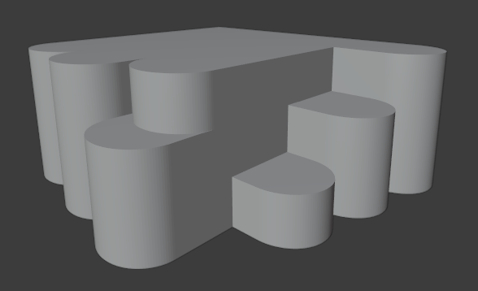

<h1 align="center">Modelo 15</h2>

<h2 align="center">📝 rules_15.slx</h2>

#### **_\#C1: Initial settings_**

_label = "building"; width = 9; depth = 8; height = 5;_

#### **_\#C2: Generating mass model_**

_{<> -> createShape("building", width, depth, height)};_

\# GRID:

#### **_\#C3: Adding virtual shape to the mass model_**

_{< descendant() [label=="building"] / [label=="building_front"] > -> createGrid("main_front_grid", 3, 6)};_

#### **_\#C4: Adding virtual shape to the mass model_**

_{< descendant() [label=="building"] / [label=="building_back"] > -> createGrid("main_back_grid", 3, 6)};_

#### **_\#C5: Adding virtual shape to the mass model_**

_{< descendant() [label=="building"] / [label=="building_left"] > -> createGrid("main_left_grid", 3, 6)};_

#### **_\#C6: Adding virtual shape to the mass model_**

_{< descendant() [label=="building"] / [label=="building_right"] > -> createGrid("main_right_grid", 3, 6)};_

\# BACK:

#### **_\#C7: Selecting region and performing extrusion_**

_{< descendant() [label=="building"] / [label=="building_back"] / [label=="main_back_grid"] / [type=="cell"] [rowIdx in (1, 2, 3)] [colIdx in (1, 2)] [::groupRegions()] > -> addVolume("north_1", "building_back", 2.5, ["north_1_front", "north_1_left", "north_1_right"])};_

#### **_\#C8: Applying roundShape deformation_**

_{< descendant() [label=="building"] / [label=="building_back"] / [label=="north_1"] / [label=="north_1_front"] > -> roundShape("front", "outside", 0.33, 30, "main_back", "vertical")};_

#### **_\#C9: Selecting region and performing extrusion_**

_{< descendant() [label=="building"] / [label=="building_back"] / [label=="main_back_grid"] / [type=="cell"] [rowIdx in (1, 2, 3)] [colIdx in (3, 4)] [::groupRegions()] > -> addVolume("north_2", "building_back", 3, ["north_2_front", "north_2_left", "north_2_right"])};_

#### **_\#C10: Applying roundShape deformation_**

_{< descendant() [label=="building"] / [label=="building_back"] / [label=="north_2"] / [label=="north_2_front"] > -> roundShape("front", "outside", 0.33, 30, "main_back", "vertical")};_

#### **_\#C11: Selecting region and performing extrusion_**

_{< descendant() [label=="building"] / [label=="building_back"] / [label=="main_back_grid"] / [type=="cell"] [rowIdx in (2, 3)] [colIdx in (5, 6)] [::groupRegions()] > -> addVolume("north_3", "building_back", 3.5, ["north_3_front", "north_3_left", "north_3_right"])};_

#### **_\#C12: Applying roundShape deformation_**

_{< descendant() [label=="building"] / [label=="building_back"] / [label=="north_3"] / [label=="north_3_front"] > -> roundShape("front", "outside", 0.33, 30, "main_back", "vertical")};_

#### **_\#C13: Selecting region and performing extrusion_**

_{< descendant() [label=="building"] / [label=="building_back"] / [label=="main_back_grid"] / [type=="cell"] [rowIdx in (1)] [colIdx in (5, 6)] [::groupRegions()] > -> addVolume("north_top", "building_back", 2, ["north_top_front", "north_top_left", "north_top_right"])};_

#### **_\#C14: Applying roundShape deformation_**

_{< descendant() [label=="building"] / [label=="building_back"] / [label=="north_top"] / [label=="north_top_front"] > -> roundShape("front", "outside", 0.33, 30, "main_back", "vertical")};_

\# RIGHT:

#### 15: Selecting region and performing extrusion\*\*\*

_{< descendant() [label=="building"] / [label=="building_left"] / [label=="main_left_grid"] / [type=="cell"] [rowIdx in (3)] [colIdx in (1, 2)] [::groupRegions()] > -> addVolume("west_1", "building_left", 2.5, ["west_1_front", "west_1_left", "west_1_right"])};_

#### **_\#C16: Applying roundShape deformation_**

_{< descendant() [label=="building"] / [label=="building_left"] / [label=="west_1"] / [label=="west_1_front"] > -> roundShape("front", "outside", 0.33, 30, "main_left", "vertical")};_

#### **_\#C17: Selecting region and performing extrusion_**

_{< descendant() [label=="building"] / [label=="building_left"] / [label=="main_left_grid"] / [type=="cell"] [rowIdx in (2, 3)] [colIdx in (3, 4)] [::groupRegions()] > -> addVolume("west_2", "building_left", 3, ["west_2_front", "west_2_left", "west_2_right"])};_

#### **_\#C18: Applying roundShape deformation_**

_{< descendant() [label=="building"] / [label=="building_left"] / [label=="west_2"] / [label=="west_2_front"] > -> roundShape("front", "outside", 0.33, 30, "main_left", "vertical")};_

#### **_\#C19: Selecting region and performing extrusion_**

_{< descendant() [label=="building"] / [label=="building_left"] / [label=="main_left_grid"] / [type=="cell"] [rowIdx in (1, 2, 3)] [colIdx in (5, 6)] [::groupRegions()] > -> addVolume("west_3", "building_left", 3.5, ["west_3_front", "west_3_left", "west_3_right"])};_

#### **_\#C20: Applying roundShape deformation_**

_{< descendant() [label=="building"] / [label=="building_left"] / [label=="west_3"] / [label=="west_3_front"] > -> roundShape("front", "outside", 0.33, 30, "main_left", "vertical")};_

---

<h2 align="center">🏢 Resultado</h2>

  

