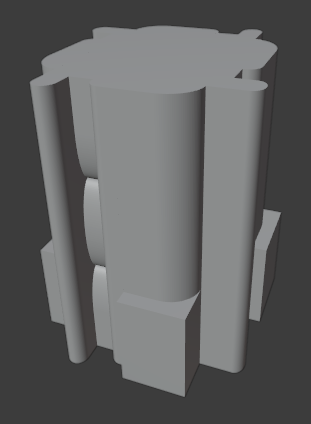

<h1 align="center">Modelo 16</h2>

<h2 align="center">📝 rules_16.slx</h2>

#### **_\#C1: Initial settings_**

_label = "building"; width = 9; depth = 11; height = 20;_

#### **_#C2: Generating mass model_**

_{<> -> createShape("building", width, depth, height)};_

\# GRID:

#### **_\#C3: Adding virtual shape to the mass model_**

_{< descendant() [label=="building"] / [label=="building_front"] > -> createGrid("main_front_grid", 3, 6)};_

#### **_\#C4: Adding virtual shape to the mass model_**

_{< descendant() [label=="building"] / [label=="building_back"] > -> createGrid("main_back_grid", 3, 6)};_

#### **_\#C5: Adding virtual shape to the mass model_**

_{< descendant() [label=="building"] / [label=="building_left"] > -> createGrid("main_left_grid", 3, 6)};_

#### **_\#C6: Adding virtual shape to the mass model_**

_{< descendant() [label=="building"] / [label=="building_right"] > -> createGrid("main_right_grid", 3, 6)};_

\# FRONT:

#### **_\#C7: Selecting region and performing extrusion_**

_{< descendant() [label=="building"] / [label=="building_front"] / [label=="main_front_grid"] / [type=="cell"] [rowIdx in (1, 2, 3)] [colIdx in (1)] [::groupRegions()] > -> addVolume("south_1", "building_front", 3, ["south_1_front", "south_1_left", "south_1_right"])};_

#### **_\#C8: Applying roundShape deformation_**

_{< descendant() [label=="building"] / [label=="building_front"] / [label=="south_1"] / [label=="south_1_front"] > -> roundShape("front", "outside", 0.16, 30, "main_front", "vertical")};_

#### **_\#C9: Selecting region and performing extrusion_**

_{< descendant() [label=="building"] / [label=="building_front"] / [label=="main_front_grid"] / [type=="cell"] [rowIdx in (1)] [colIdx in (2)] [::groupRegions()] > -> addVolume("south_2", "building_front", 1, ["south_2_front", "south_2_left", "south_2_right"])};_

#### **_\#C10: Applying roundShape deformation_**

_{< descendant() [label=="building"] / [label=="building_front"] / [label=="south_2"] / [label=="south_2_front"] > -> roundShape("bottom", "outside", 0.33, 30, "main_front")};_

#### **_\#C11: Selecting region and performing extrusion_**

_{< descendant() [label=="building"] / [label=="building_front"] / [label=="main_front_grid"] / [type=="cell"] [rowIdx in (2)] [colIdx in (2)] [::groupRegions()] > -> addVolume("south_3", "building_front", 1, ["south_3_front", "south_3_left", "south_3_right"])};_

#### **_\#C12: Applying roundShape deformation_**

_{< descendant() [label=="building"] / [label=="building_front"] / [label=="south_3"] / [label=="south_3_front"] > -> roundShape("front", "outside", 0.33, 30, "main_front", "horizontal")};_

#### **_\#C13: Selecting region and performing extrusion_**

_{< descendant() [label=="building"] / [label=="building_front"] / [label=="main_front_grid"] / [type=="cell"] [rowIdx in (3)] [colIdx in (2)] [::groupRegions()] > -> addVolume("south_4", "building_front", 1, ["south_4_front", "south_4_left", "south_4_right"])};_

#### **_\#C14: Applying roundShape deformation_**

_{< descendant() [label=="building"] / [label=="building_front"] / [label=="south_4"] / [label=="south_4_front"] > -> roundShape("top", "outside", 0.33, 30, "main_front")};_

#### **_\#C15: Selecting region and performing extrusion_**

_{< descendant() [label=="building"] / [label=="building_front"] / [label=="main_front_grid"] / [type=="cell"] [rowIdx in (1, 2, 3)] [colIdx in (3)] [::groupRegions()] > -> addVolume("south_5", "building_front", 2, ["south_5_front", "south_5_left", "south_5_right"])};_

#### **_\#C16: Applying roundShape deformation_**

_{< descendant() [label=="building"] / [label=="building_front"] / [label=="south_5"] / [label=="south_5_front"] > -> roundShape("left", "outside", 0.16, 30, "main_front")};_

#### **_\#C17: Selecting region and performing extrusion_**

_{< descendant() [label=="building"] / [label=="building_front"] / [label=="main_front_grid"] / [type=="cell"] [rowIdx in (3)] [colIdx in (4, 5, 6)] [::groupRegions()] > -> addVolume("south_6", "building_front", 3, ["south_6_front", "south_6_left", "south_6_right"])};_

#### **_\#C18: Selecting region and performing extrusion_**

_{< descendant() [label=="building"] / [label=="building_front"] / [label=="main_front_grid"] / [type=="cell"] [rowIdx in (1, 2)] [colIdx in (4, 5, 6)] [::groupRegions()] > -> addVolume("south_7", "building_front", 2, ["south_7_front", "south_7_left", "south_7_right"])};_

#### **_\#C19: Applying roundShape deformation_**

_{< descendant() [label=="building"] / [label=="building_front"] / [label=="south_7"] / [label=="south_7_front"] > -> roundShape("right", "outside", 0.48, 30, "main_front")};_

\# BACK:

#### **_\#C20: Selecting region and performing extrusion_**

_{< descendant() [label=="building"] / [label=="building_back"] / [label=="main_back_grid"] / [type=="cell"] [rowIdx in (1, 2, 3)] [colIdx in (1)] [::groupRegions()] > -> addVolume("north_1", "building_back", 3, ["north_1_front", "north_1_left", "north_1_right"])};_

#### **_\#C21: Applying roundShape deformation_**

_{< descendant() [label=="building"] / [label=="building_back"] / [label=="north_1"] / [label=="north_1_front"] > -> roundShape("front", "outside", 0.16, 30, "main_back", "vertical")};_

#### **_\#C22: Selecting region and performing extrusion_**

_{< descendant() [label=="building"] / [label=="building_back"] / [label=="main_back_grid"] / [type=="cell"] [rowIdx in (1)] [colIdx in (2)] [::groupRegions()] > -> addVolume("north_2", "building_back", 1, ["north_2_front", "north_2_left", "north_2_right"])};_

#### **_\#C23: Applying roundShape deformation_**

_{< descendant() [label=="building"] / [label=="building_back"] / [label=="north_2"] / [label=="north_2_front"] > -> roundShape("bottom", "outside", 0.33, 30, "main_back")};_

#### **_\#C24: Selecting region and performing extrusion_**

_{< descendant() [label=="building"] / [label=="building_back"] / [label=="main_back_grid"] / [type=="cell"] [rowIdx in (2)] [colIdx in (2)] [::groupRegions()] > -> addVolume("north_3", "building_back", 1, ["north_3_front", "north_3_left", "north_3_right"])};_

#### **_\#C25: Applying roundShape deformation_**

_{< descendant() [label=="building"] / [label=="building_back"] / [label=="north_3"] / [label=="north_3_front"] > -> roundShape("front", "outside", 0.33, 30, "main_back", "horizontal")};_

#### **_\#C26: Selecting region and performing extrusion_**

_{< descendant() [label=="building"] / [label=="building_back"] / [label=="main_back_grid"] / [type=="cell"] [rowIdx in (3)] [colIdx in (2)] [::groupRegions()] > -> addVolume("north_4", "building_back", 1, ["north_4_front", "north_4_left", "north_4_right"])};_

#### **_\#C27: Applying roundShape deformation_**

_{< descendant() [label=="building"] / [label=="building_back"] / [label=="north_4"] / [label=="north_4_front"] > -> roundShape("top", "outside", 0.33, 30, "main_back")};_

#### **_\#C28: Selecting region and performing extrusion_**

_{< descendant() [label=="building"] / [label=="building_back"] / [label=="main_back_grid"] / [type=="cell"] [rowIdx in (1, 2, 3)] [colIdx in (3)] [::groupRegions()] > -> addVolume("north_5", "building_back", 2, ["north_5_front", "north_5_left", "north_5_right"])};_

#### **_\#C29: Applying roundShape deformation_**

_{< descendant() [label=="building"] / [label=="building_back"] / [label=="north_5"] / [label=="north_5_front"] > -> roundShape("left", "outside", 0.16, 30, "main_back")};_

#### **_\#C30: Selecting region and performing extrusion_**

_{< descendant() [label=="building"] / [label=="building_back"] / [label=="main_back_grid"] / [type=="cell"] [rowIdx in (3)] [colIdx in (4, 5, 6)] [::groupRegions()] > -> addVolume("north_6", "building_back", 3, ["north_6_front", "north_6_left", "north_6_right"])};_

#### **_\#C31: Selecting region and performing extrusion_**

_{< descendant() [label=="building"] / [label=="building_back"] / [label=="main_back_grid"] / [type=="cell"] [rowIdx in (1, 2)] [colIdx in (4, 5, 6)] [::groupRegions()] > -> addVolume("north_7", "building_back", 2, ["north_7_front", "north_7_left", "north_7_right"])};_

#### **_\#C32: Applying roundShape deformation_**

_{< descendant() [label=="building"] / [label=="building_back"] / [label=="north_7"] / [label=="north_7_front"] > -> roundShape("right", "outside", 0.48, 30, "main_back")};_

\# LEFT:

#### **_\#C33: Selecting region and performing extrusion_**

_{< descendant() [label=="building"] / [label=="building_left"] / [label=="main_left_grid"] / [type=="cell"] [rowIdx in (1, 2, 3)] [colIdx in (1)] [::groupRegions()] > -> addVolume("west_1", "building_left", 3, ["west_1_front", "west_1_left", "west_1_right"])};_

#### **_\#C34: Applying roundShape deformation_**

_{< descendant() [label=="building"] / [label=="building_left"] / [label=="west_1"] / [label=="west_1_front"] > -> roundShape("front", "outside", 0.16, 30, "main_left", "vertical")};_

#### **_\#C35: Selecting region and performing extrusion_**

_{< descendant() [label=="building"] / [label=="building_left"] / [label=="main_left_grid"] / [type=="cell"] [rowIdx in (1)] [colIdx in (2)] [::groupRegions()] > -> addVolume("west_2", "building_left", 1, ["west_2_front", "west_2_left", "west_2_right"])};_

#### **_\#C36: Applying roundShape deformation_**

_{< descendant() [label=="building"] / [label=="building_left"] / [label=="west_2"] / [label=="west_2_front"] > -> roundShape("bottom", "outside", 0.33, 30, "main_left")};_

#### **_\#C37: Selecting region and performing extrusion_**

_{< descendant() [label=="building"] / [label=="building_left"] / [label=="main_left_grid"] / [type=="cell"] [rowIdx in (2)] [colIdx in (2)] [::groupRegions()] > -> addVolume("west_3", "building_left", 1, ["west_3_front", "west_3_left", "west_3_right"])};_

#### **_\#C38: Applying roundShape deformation_**

_{< descendant() [label=="building"] / [label=="building_left"] / [label=="west_3"] / [label=="west_3_front"] > -> roundShape("front", "outside", 0.33, 30, "main_left", "horizontal")};_

#### **_\#C39: Selecting region and performing extrusion_**

_{< descendant() [label=="building"] / [label=="building_left"] / [label=="main_left_grid"] / [type=="cell"] [rowIdx in (3)] [colIdx in (2)] [::groupRegions()] > -> addVolume("west_4", "building_left", 1, ["west_4_front", "west_4_left", "west_4_right"])};_

#### **_\#C40: Applying roundShape deformation_**

_{< descendant() [label=="building"] / [label=="building_left"] / [label=="west_4"] / [label=="west_4_front"] > -> roundShape("top", "outside", 0.33, 30, "main_left")};_

#### **_\#C41: Selecting region and performing extrusion_**

_{< descendant() [label=="building"] / [label=="building_left"] / [label=="main_left_grid"] / [type=="cell"] [rowIdx in (1, 2, 3)] [colIdx in (3)] [::groupRegions()] > -> addVolume("west_5", "building_left", 2, ["west_5_front", "west_5_left", "west_5_right"])};_

#### **_\#C42: Applying roundShape deformation_**

_{< descendant() [label=="building"] / [label=="building_left"] / [label=="west_5"] / [label=="west_5_front"] > -> roundShape("left", "outside", 0.16, 30, "main_left")};_

#### **_\#C43: Selecting region and performing extrusion_**

_{< descendant() [label=="building"] / [label=="building_left"] / [label=="main_left_grid"] / [type=="cell"] [rowIdx in (3)] [colIdx in (4, 5, 6)] [::groupRegions()] > -> addVolume("west_6", "building_left", 3, ["west_6_front", "west_6_left", "west_6_right"])};_

#### **_\#C44: Selecting region and performing extrusion_**

_{< descendant() [label=="building"] / [label=="building_left"] / [label=="main_left_grid"] / [type=="cell"] [rowIdx in (1, 2)] [colIdx in (4, 5, 6)] [::groupRegions()] > -> addVolume("west_7", "building_left", 2, ["west_7_front", "west_7_left", "west_7_right"])};_

#### **_\#C45: Applying roundShape deformation_**

_{< descendant() [label=="building"] / [label=="building_left"] / [label=="west_7"] / [label=="west_7_front"] > -> roundShape("right", "outside", 0.48, 30, "main_left")};_

\# RIGHT:

#### **_\#C46: Selecting region and performing extrusion_**

_{< descendant() [label=="building"] / [label=="building_right"] / [label=="main_right_grid"] / [type=="cell"] [rowIdx in (1, 2, 3)] [colIdx in (1)] [::groupRegions()] > -> addVolume("east_1", "building_right", 3, ["east_1_front", "east_1_left", "east_1_right"])};_

#### **_\#C47: Applying roundShape deformation_**

_{< descendant() [label=="building"] / [label=="building_right"] / [label=="east_1"] / [label=="east_1_front"] > -> roundShape("front", "outside", 0.16, 30, "main_right", "vertical")};_

#### **_\#C48: Selecting region and performing extrusion_**

_{< descendant() [label=="building"] / [label=="building_right"] / [label=="main_right_grid"] / [type=="cell"] [rowIdx in (1)] [colIdx in (2)] [::groupRegions()] > -> addVolume("east_2", "building_right", 1, ["east_2_front", "east_2_left", "east_2_right"])};_

#### **_\#C49: Applying roundShape deformation_**

_{< descendant() [label=="building"] / [label=="building_right"] / [label=="east_2"] / [label=="east_2_front"] > -> roundShape("bottom", "outside", 0.33, 30, "main_right")};_

#### **_\#C50: Selecting region and performing extrusion_**

_{< descendant() [label=="building"] / [label=="building_right"] / [label=="main_right_grid"] / [type=="cell"] [rowIdx in (2)] [colIdx in (2)] [::groupRegions()] > -> addVolume("east_3", "building_right", 1, ["east_3_front", "east_3_left", "east_3_right"])};_

#### **_\#C51: Applying roundShape deformation_**

_{< descendant() [label=="building"] / [label=="building_right"] / [label=="east_3"] / [label=="east_3_front"] > -> roundShape("front", "outside", 0.33, 30, "main_right", "horizontal")};_

#### **_\#C52: Selecting region and performing extrusion_**

_{< descendant() [label=="building"] / [label=="building_right"] / [label=="main_right_grid"] / [type=="cell"] [rowIdx in (3)] [colIdx in (2)] [::groupRegions()] > -> addVolume("east_4", "building_right", 1, ["east_4_front", "east_4_left", "east_4_right"])};_

#### **_\#C53: Applying roundShape deformation_**

_{< descendant() [label=="building"] / [label=="building_right"] / [label=="east_4"] / [label=="east_4_front"] > -> roundShape("top", "outside", 0.33, 30, "main_right")};_

#### **_\#C54: Selecting region and performing extrusion_**

_{< descendant() [label=="building"] / [label=="building_right"] / [label=="main_right_grid"] / [type=="cell"] [rowIdx in (1, 2, 3)] [colIdx in (3)] [::groupRegions()] > -> addVolume("east_5", "building_right", 2, ["east_5_front", "east_5_left", "east_5_right"])};_

#### **_\#C55: Applying roundShape deformation_**

_{< descendant() [label=="building"] / [label=="building_right"] / [label=="east_5"] / [label=="east_5_front"] > -> roundShape("left", "outside", 0.16, 30, "main_right")};_

#### **_\#C56: Selecting region and performing extrusion_**

_{< descendant() [label=="building"] / [label=="building_right"] / [label=="main_right_grid"] / [type=="cell"] [rowIdx in (3)] [colIdx in (4, 5, 6)] [::groupRegions()] > -> addVolume("east_6", "building_right", 3, ["east_6_front", "east_6_left", "east_6_right"])};_

#### **_\#C57: Selecting region and performing extrusion_**

_{< descendant() [label=="building"] / [label=="building_right"] / [label=="main_right_grid"] / [type=="cell"] [rowIdx in (1, 2)] [colIdx in (4, 5, 6)] [::groupRegions()] > -> addVolume("east_7", "building_right", 2, ["east_7_front", "east_7_left", "east_7_right"])};_

#### **_\#C58: Applying roundShape deformation_**

_{< descendant() [label=="building"] / [label=="building_right"] / [label=="east_7"] / [label=="east_7_front"] > -> roundShape("right", "outside", 0.48, 30, "main_right")};_

---

<h2 align="center">🏢 Resultado</h2>

  

